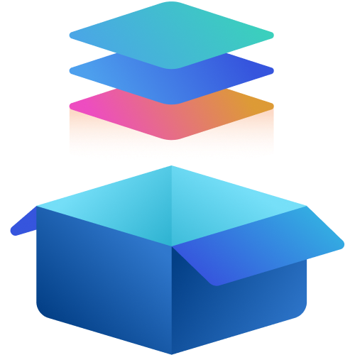
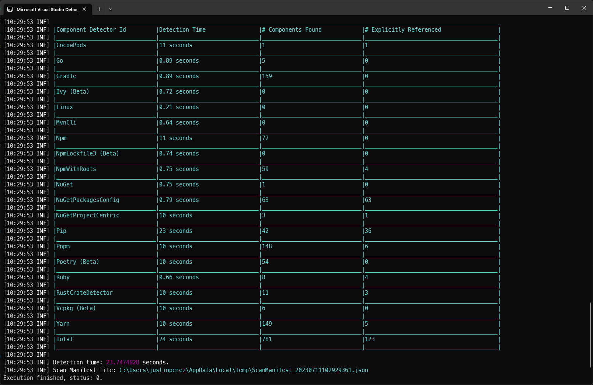

<h1 align="center">
  <br>
  <a href="<What link>"></a>
  <br>
  Component Detection
  <br>
</h1>

<h4 align="center">Automatically detect the open-source libraries you use.</h4>

<p align="center">
    
    
    
    
    
</p>

<p align="center">
  <a href="#features">Features</a> •
  <a href="#how-to-use">How To Use</a> •
  <a href="#download">Download</a> •
</p>

**Component Detection** (CD) is a package scanning tool that is intended to be used at build time. It produces a graph-based output of all detected components across a variety of package ecosystems.

Component Detection can also be used as a library to detect dependencies in your own applications.



## Features

Component Detection supports detecting libraries from the following ecosystem:

| Ecosystem                                                                        | Scanning                                        | Graph Creation |
| -------------------------------------------------------------------------------- | ----------------------------------------------- | -------------- |
| CocoaPods                                                                        | ✔                                               | ✔              |
| [Go](docs/detectors/go.md)                                                       | ✔                                               | ❌              |
| [Gradle (lockfiles only)](docs/detectors/gradle.md)                              | ✔                                               | ❌              |
| [Linux (Debian, Alpine, Rhel, Centos, Fedora, Ubuntu)](docs/detectors//linux.md) | ✔ (via [syft](https://github.com/anchore/syft)) | ❌              |
| [Maven](docs/detectors/maven.md)                                                 | ✔                                               | ✔              |
| [NPM (including Yarn, Pnpm)](docs/detectors/npm.md)                              | ✔                                               | ✔              |
| [NuGet (including Paket)](docs/detectors/nuget.md)                               | ✔                                               | ✔              |
| [Pip (Python)](docs/detectors/pip.md)                                            | ✔                                               | ✔              |
| [Poetry (Python, lockfiles only)](docs/detectors/poetry.md)                      | ✔                                               | ❌              |
| Ruby                                                                             | ✔                                               | ✔              |
| Rust                                                                             | ✔                                               | ✔              |

For a complete feature overview refer to [feature-overview.md](docs/feature-overview.md)

## How To Use

To clone and run this application, you'll need [Git](https://git-scm.com) and [.NET 6](https://aka.ms/download-dotnet) installed on your computer. From your command line:

```bash
# Clone this repository
$ git clone https://github.com/microsoft/component-detection

# Go into the repository
$ cd component-detection 

# Run the app
$ dotnet run 
```

View the [detector arguments](docs/detector-arguments.md) for more information on how to use the tool.

## Download

You can [download](https://github.com/microsoft/component-detection/releases/tag/latest) the latest version of Component Detection for Windows, macOS and Linux.

## Using Codespaces

You can also use [GitHub Codespaces](https://docs.github.com/en/codespaces/overview) to run and develop Component Detection in the cloud. To do so, click the green "Code" button at the top of the repository and select "Open with Codespaces". This will open a new Codespace with the repository cloned and ready to go.

# A detector is marked as DefaultOff/Experimental. What does that mean?

Detectors have 3 levels of "stability":
* `DefaultOff`
* `Experimental`
* `Stable`

DefaultOff detectors need to be explicitly enabled to run and produce a final graph output. Experimental detectors run by default but **will not** produce a final graph output. Stable detectors run and produce a final graph output by default. Here is how you can [enable default off/experimental](./docs/enable-default-off.md) detectors. The status of each detector can also be found [here](./docs/detectors/README.md)

# Telemetry

By default, telemetry will output to your output file path and will be a JSON blob. No data is submitted to Microsoft.

# Code of Conduct

This project has adopted the [Microsoft Open Source Code of Conduct](https://opensource.microsoft.com/codeofconduct/).
For more information see the [Code of Conduct FAQ](https://opensource.microsoft.com/codeofconduct/faq/)
or contact [opencode@microsoft.com](mailto:opencode@microsoft.com) with any additional questions or comments.

# Trademarks

This project may contain trademarks or logos for projects, products, or services. Authorized use of Microsoft trademarks or logos is subject to and must follow Microsoft's Trademark & Brand Guidelines. Use of Microsoft trademarks or logos in modified versions of this project must not cause confusion or imply Microsoft sponsorship. Any use of third-party trademarks or logos are subject to those third-party's policies.