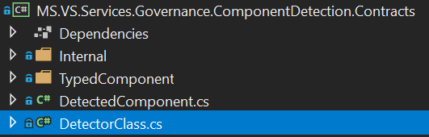
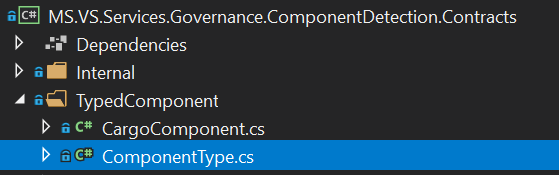
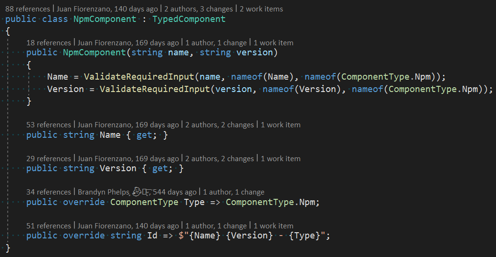
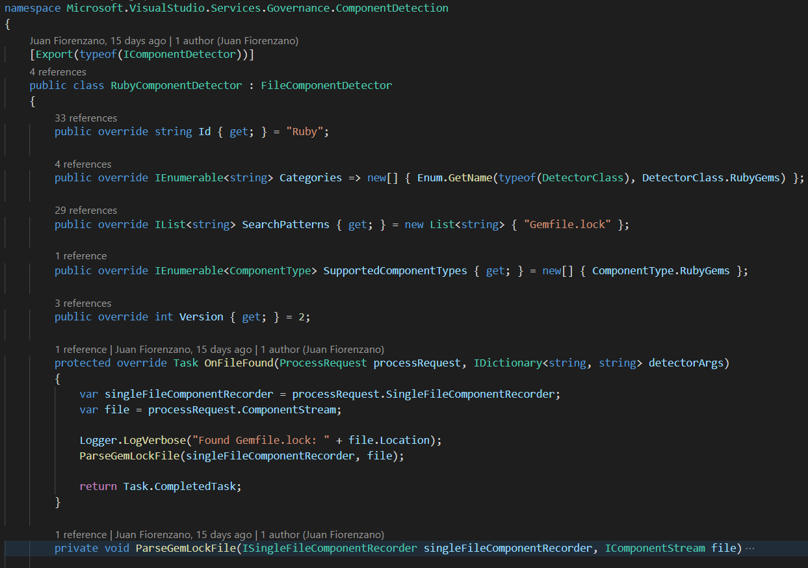
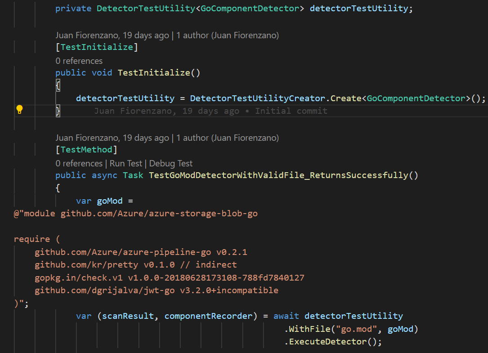

# How detectors work
When the detection tool runs, it uses a parameter called --SourceDirectory to specify the path to run the detectors. Before executing the detectors on the Path specified by the parameter SourceDirectory, detectors are filtered using one of the following parameters:

- **DetectorCategory**: It filter using the property Categories of the detector
- **DetectorFilters**: It filter the detector using the property Id of the detector

Once the detectors are filtered, they are executed asynchronously. There are 2 types of detectors. Base detectors which only get executed once and file based detectors which are executed every time a file matches the detector's SearchPattern property. You can easily differentiate a base detector from a file based detector. Base detectors simply implement the `IComponentDetector` interface while file based detectors are a subclass of `FileComponentDetector`.

Since base detectors are relatively basic and unopinionated we will focus on file based detectors for the rest of this document.

# Detector File Processing Lifecycle

Once a file is matched, it is processed through 3 lifecycle methods in the following order.

## `OnPrepareDetection`

This is an optional override for file based detectors. It is used to logically separate the actual detection of components from any preparatory setup/filtering that may be required before the main parsing. For example, when detecting `npm` components, we want to ignore files found in `node_modules` if we already have a top level `package-lock.json`. This type of filtering/setup fits in `OnPrepareDetection`.

## `OnFileFound`

This is a required override for file based detectors. It contains the main logic for parsing manifest files and building dependency graphs.

## `OnDetectionFinished`

This is an optional override for file based detectors. It is used for any terminal or cleanup work that should happen after the main processing. For example, deleting any temporary files that might have been created in either of the previous 2 lifecycle methods.

# Detector Lifecycle

A new detector goes through different stages before it is part of the set of the default detectors, your job as a contributor is just to create the detector in the first stage, a member of the maintainers team is going to be in charge on continuing progressing the detector through the next stages.

|  **DefaultOffComponentDetector** | **ExperimentalDetector**  | **DefaultComponentDetector**  |
|---|---|---|
| this is the first stage of the detector in this stage the detector is not going to run unless a user voluntarily opts it in. During this first stage we need to evaluate and test the detector, the detector should be totally functional and produce the expected components. | In this stage we are going to measure the performance impact. The detector's component graph is not captured in the final result output. Normally detectors stay in this stage for a week before being analyzed to proceed to the next and final stage. | This is the last stage, when a detector is part of the default set, it can be called using the parameters **DetectorCategory** or **DetectorFilters** |

# How to create a new detector

## Create a new branch
The default branch of the Component Detection Tool is main, all new branches should branch out from it using the following structure:

	[username]/[branch-title]

	Ex:
	jufioren/my-first-detector

## Setting up your component type

Before creating the actual detector it is necessary to create the type of components that your detector is going to recognize (you can skip this step if your detector is going to reuse one of the existing types).
First register the category of your detector. The detector category is a way to group detectors that create the same of type of components. If your detector needs a different component type then you need to
add a new category. In order to create a new category you only need to add a new entry in the _enum DetectorClass_ and you can find it in the project _Contracts_.



Once the new category was added you can proceed to add the type of components that your detector is going to create, to do that just add a new entry in the _enum ComponentType_, the file is in the project Contracts inside the folder _TypedComponent_



After the type is registered your next step is to create a class for the component, to do that just create a class in the same folder _TypedComponent_, this class is going to contain the properties that you are going to parse from the file to represent the component, most of components just need the dependency name and version, but in same cases like the MavenComponent, the properties are different, we highly recommend investigating how that is managed by the package manager and align with that community's terminology.
To add a new type, go to the Contracts project and create a new class inside the folder _TypedComponent_. In the next figure you can see an example of a component in this case is the definition of NpmComponent.



<span style="color:red">**Important:**</span> Not all properties on a component are required. To set your required properties use the ValidateRequiredInput method. It is possible for other detectors to create your new component type so you must validate as much as possible internally in the component. For an example of a component that have a mix of required properties and optional look at the class OtherComponent. Components should be immutable so don't expose setters for the properties.

## Create the detector class

Go inside the project MS.VS.Services.Governance.ComponentDetection.Detectors, and create a new folder for your detector. Inside this folder is where all the classes that your detector need are going to live. After you create the folder you can proceed and create a new class for your detector, and you can choose other detectors as a template to start yours. Since all detectors should implement the same properties and methods, for this guide we are going to use the RubyComponentDetector class as an example to explain the different properties that comprise a detector and how to implement the main methods.



- **Constructor Injection**: Detectors use standard .NET dependency injection. Inject required services like `IComponentStreamEnumerableFactory`, `IObservableDirectoryWalkerFactory`, and `ILogger<T>` through the constructor.
- **FileComponentDetector**: This is base class of all file based detectors
- **IDefaultOffComponentDetector**: All new detectors should also implement this interface (not shown in above screenshot) so new detectors are not going to run as part of the default set of detectors. They are only run when a user manually enables the detector via [argument](./enable-default-off.md).
- **Id**: Detector's identifier
- **Categories**: The categories is a way to group detectors, detectors that create the same type of components belong to the same category, for example Npm, Pnpm and Yarn create the same component type Npm, then they belong to the same category.
- **SearchPatterns**: This property defines a list of glob patterns targeting file names. For example your detector can be interested in files with the name _my_dependencies_ and the extension foo, in such a case you define the pattern _my_dependencies.foo_. Another example: your detector can be interested in files with the extension  foo, in such a case you define the pattern "*.foo".
- **SupportedComponentTypes**: Similar to categories, here we specify the kind of component(s) that this detector can create.
- **OnFileFound**: This is the main method of the detector class, this method is called with files that match the pattern defined by the property SearchPattern. All files are processed asynchronously. In this example the method that actually extracts the dependencies from the file is called ParseGemLockFile.

- **IndividualDetectorScanResult**: As the name suggest this is the result of the scanning and is composed of two properties, ResultCode and AdditionalTelemetry, the former indicates if the scanning was successful or not, the latter is a free form dictionary for telemetry. The ResultCode is `Success` unless otherwise specified. In general we recommend creating new telemetry records over using the `AdditionalTelemetry` property.

### Advanced detection
The above example is a basic introduction to creating your own detector and should be sufficient for most new detectors. Sometimes you need more granularity when processing files, as such we have 2 additional detection [lifecycle methods](#-Detector-File-Processing-Lifecycle).

## Register the detector in dependency injection

After creating your detector class, you must register it in the dependency injection container. Add your detector to `src/Microsoft.ComponentDetection.Orchestrator/Extensions/ServiceCollectionExtensions.cs` in the `AddComponentDetection` method:

```csharp
// YourEcosystem
services.AddSingleton<IComponentDetector, YourDetector>();
```

This registration allows the orchestrator to discover and instantiate your detector at runtime.

## Registering Components

Each instance of a detector has a `ComponentRecorder`. A `ComponentRecorder` contains a set of `SingleFileComponentRecorder`s. A `SingleFileComponentRecorder` is an immutable graph store for components associated to a particular file. The purpose of any detector is to populate a given `SingleFileComponentRecorder` with a graph representation of all of the components found in a given file.

For each matching file that was found, `OnFileFound` will be called with a `ProcessRequest`. The `ProcessRequest` contains an `IComponentStream` and an `ISingleFileComponentRecorder`.

### `IComponentStream`

This interface is the current file to parse has the following properties:

- `Stream`: A stream of the bytes of the file
- `Pattern`: The pattern that was used to match against the file name.
- `Location`: The full path of the file on disk.

### `ISingleFileComponentRecorder`

This interface provides methods for inserting into the immutable `SingleFileComponentRecorder` graph.

- `RegisterUsage`: The most important method. Allows you to register a component you have parsed from your file into the immutable graph.

#### `RegisterUsage`

Lets break down the arguments available to `RegisterUsage` and what they mean.

- `DetectedComponent`: It will be represented as a node in the graph. In general, only the `Component` property  must be populated on `DetectedComponent`. This `Component` will be one of the `TypedComponent` subclasses that either already exist or you created earlier.

- `isExplicitlyReferencedDependency`: This flag tracks whether a user explicitly referenced this component. In other words "Is this component as transitive dependency?". An example would be all of the packages listed in a `package.json`.

- `parentComponentId`: This is the Id of the parent of the component currently being registered. This is how you add an edge to the graph. Not all packages managers structure their files in a way that supports a graph representation. In those cases we do not specify parent components.

- `isDevelopmentDependency`: Is the component being registered being referenced as a development dependency. The definition of development dependency is not always consistent across package managers. It might sometimes be called a build dependency. In general, if the component will not be present/referenced in the final output, it is a development dependency.

It is expected that once `OnFileFound` completes, the `SingleFileComponentRecorder` associated with that file contains an accurate graph representation of the components found in that file.

## Create Detector Tests

We have two kind of tests for our detectors, unit tests and pre-production tests that verify complete graph outputs across 2 scan runs over an identical set of files (this set of files can be found over in `test/Microsoft.ComponentDetection.VerificationTests/resources/`). In this section we are going to discuss how to add a unit test for your detector.

Detectors' unit tests are in the project _MS.VS.Services.Governance.CD.Detectors.L0.Tests_, to create a new test for your detector you just need to create a new test class inside this project.
We recommend to test just one unique scenario in each test, avoid creating dependent tests. Since a detector depends on the content of the file to extract the components, we recommend using the minimum amount of file's sections that are needed to test your scenario. In order to reduce boilerplate, typically around configuring file locations, in our testing code we created a `DetectorTestUtility`.



From the example above you can see each test is initialized with a new `DetectorTestUtility`. The test utility is generic over all `FileComponentDetectors` so it will just work with your new detector. The test defines the contents of the "file" we want our detector to scan. We then provide the file name and contents via `WithFile` to the test utility and execute the scan. We can then verify properties of the output graph using `componentRecorder` and assert success using the scan result.

## How to run/debug your detector

```sh
dotnet run --project "[YOUR REPO PATH]\src\Microsoft.ComponentDetection\Microsoft.ComponentDetection.csproj" scan
--Verbosity Verbose
--SourceDirectory [PATH TO THE REPO TO SCAN]
--DetectorArgs [YOUR DETECTOR ID]=EnableIfDefaultOff
```

- **DetectorsArgs**: The value that you care about for this parameter is [YOUR DETECTOR ID]=EnableIfDefaultOff, the id of your detector is the value of the property Id from your detector class, so if that property has the value "MyFirstDetector" then the value of this parameter should be MyFirstDetector=EnableIfDefaultOff, you need to execute your detector in this way and not using the parameter DetectorCategories or DetectorFilters because your detector implement the class IDefaultOffComponentDetector, so your detector does not belongs to the set of default detectors until some test are executed to validate that it works well in production, please refer to the section Detector Life Cycle for more details.

## How to setup E2E Verification Test

The final step of the contribution to detectors is to setup its end to end verification tests. These are located under the `test/Microsoft.ComponentDetection.VerificationTests/resources` directory.

Each directory under the `resources` directory is related to an ecosystem that Component Detection can scan. Inside each ecosystem directory there are one or more projects, each in their own directory. Each project should fully exercise the detector's capabilities.
